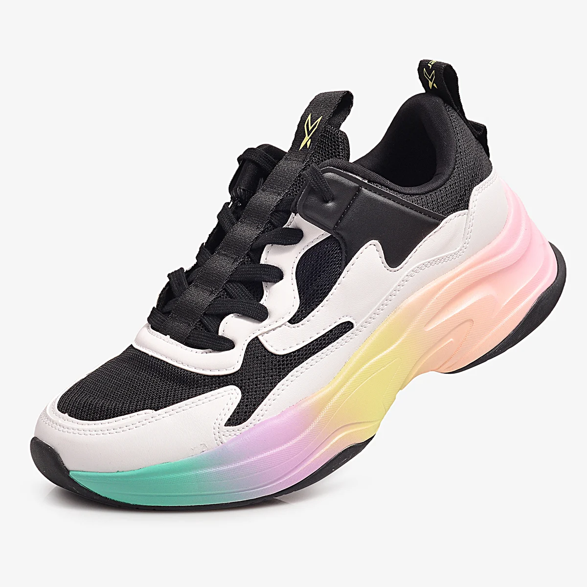

# AI-based Video Generation with I2VGen-XL

This project is an AI-based application for high-resolution video generation using the **I2VGen-XL diffusion model**. It allows users to input both images and text prompts to generate high-quality videos through a user-friendly interface. The system leverages a sophisticated model architecture and integrates seamlessly with a web-based interface and backend.

## Table of Contents
1. [Overview](#overview)
2. [Features](#features)
3. [Installation](#installation)
4. [Usage](#usage)
5. [Technologies](#technologies)
6. [License](#license)

## Overview
The application utilizes the **I2VGen-XL diffusion model** for generating high-resolution videos from image and text inputs. The model is powered by hierarchical encoders that capture both low-level and high-level image details, ensuring fine-tuned and high-quality video output.

## Features
- **High-resolution video generation** based on both image and text prompts.
- Utilizes the advanced **I2VGen-XL diffusion model** with hierarchical encoders for detailed and global image feature extraction.
- **Streamlit UI**: User-friendly interface for inputting prompts and displaying the generated videos.
- **Flask Backend**: Manages the client-server interactions and runs the model on **Google Colab**.
- **Video output**: Generated videos are displayed in the app interface.

## Installation

To set up the project locally, follow these steps:
1. Clone the repository:
   ```bash
   git clone https://github.com/username/i2vgen-xl-video-gen.git

## Usage

1. Run file Backend(jupyter notebook) in Google Colab with GPU >= L4
2. Run file Client
   ```bash
   cd AIAPP_AIGeneration_ImageToVideo
   streamlit run client_protonX_Project2_streamlit_promp.py (change link Ngrok from output of backend file)





<p align="center">   </p> <p align="center">   </p>

## Technologies
- Python, I2VGen-XL, Streamlit, Flask, Google Colab, Hugging Face Diffusers, Ngrok.
   
